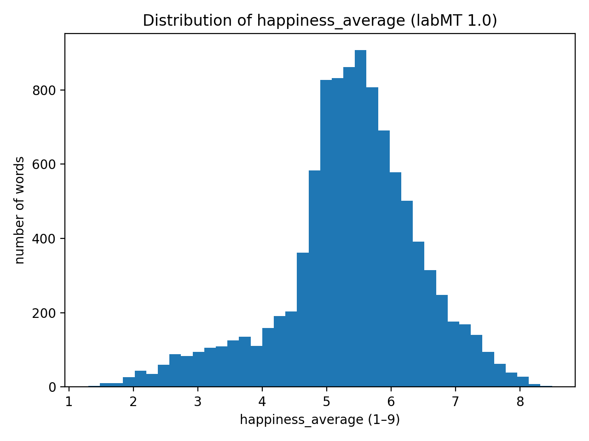
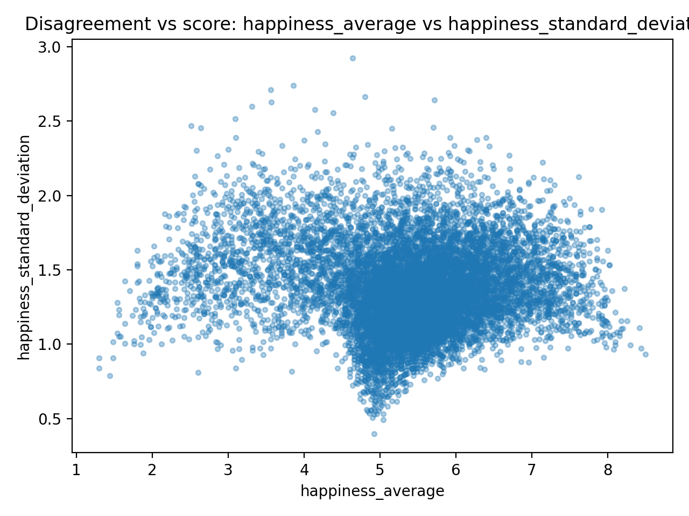
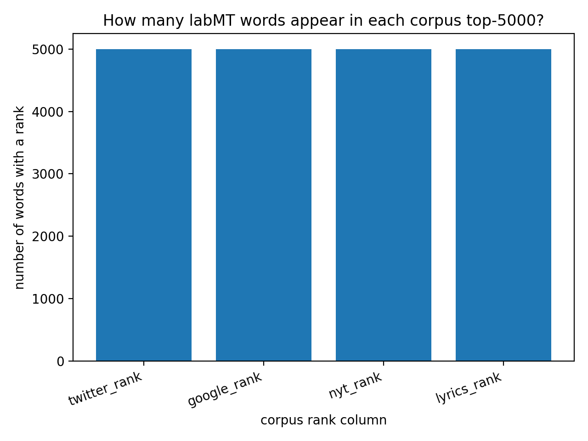
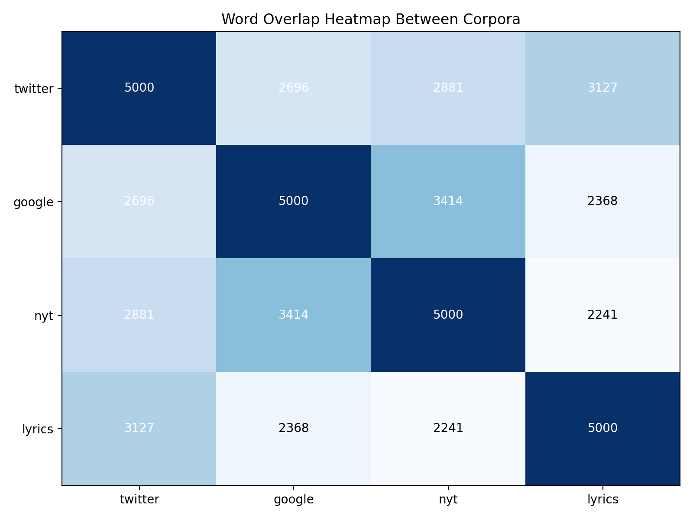

# Seminars 3 & 4 — Hedonometer (Project Folder)

This folder provides an **example project structure** (and an instructor/demo script) for the Seminars 3 & 4 group project using the **labMT 1.0** dataset (Data Set S1 from the Hedonometer paper).

It includes:
- the labMT 1.0 dataset file (`data/raw/Data_Set_S1.txt`)
- a runnable demo analysis script (`src/hedonometer_labmt_demo.py`) that produces a *typical* set of outputs aligned to the assignment
- course documents in `docs/` (original paper + paper companion + assignment + project quickstart), provided as **.pdf**

## Folder layout (course convention)

- `src/` — Python scripts you run
- `data/raw/` — input data (treat as read-only)
- `figures/` — PNG plots (embed these in your GitHub README)
- `tables/` — CSV tables/summaries (optional to embed, but useful for analysis)
- `docs/` — assignment + paper companion + quickstart handout

## Setup + run (from the project root)

### 1) Create a virtual environment

**macOS / Linux**
```bash
python3 -m venv .venv
source .venv/bin/activate
python3 -m pip install --upgrade pip
```

**Windows (PowerShell)**
```powershell
py -m venv .venv
.\.venv\Scripts\Activate.ps1
py -m pip install --upgrade pip
```

### 2) Install dependencies
```bash
python3 -m pip install -r requirements.txt
```

### 3) Run the demo analysis
```bash
python3 src/run_analysis.py
```

### What gets generated?
After running, look in:
- `figures/` — PNG plots
- `tables/` — CSV summary tables

## Commit Task 1 (1.1, 1.2, 1.3) 02/03/26
The file was loaded through downloading the assignment folder and opening the project on vscode. All group members connected to the project via github. Each group member accomplished commits after completing a fraction of the assignment. This task required a pull and a push after its successful completion. Lines 99-104 of code read the csv and ignored the first 3 rows of the data, indicated that data is separated by tabs (sep =\t"). 
Shape of dataset =  (rows, columns): (10222, 8)
A missing rank (--) in this dataset means that the information for this category is not available, and is replaced in the code by NaN. 

Data dictionary: 
| Name | Data represented  | dtype | Notes on missingness |
| --- | --- | --- | --- |
| word | data analysed | text | no misses |
| happiness_rank| position closer/further to "happiness" coordinate| float | no misses |
| happiness_average | average of __| float | no misses |
| happiness_standard_deviation | standard deviation of word from 0 | float | no misses |
| twitter_rank 
| google_rank
| nyt_rank
| lyrics_rank
| --- | --- | --- | --- | 

Sanity checks: 
| word | happiness_rank | happiness_average | happiness_standard_deviation | twitter_rank | google_rank | nyt_rank | lyrics_rank |
:--- | :--- | :--- | :--- | :--- | :--- | :--- | :--- |
| 33 | friendship | 34 | 7.96 | 1.1241 | 4273.0 | 3098.0 | 3669.0 | 3980.0 |
|1543 | designers | 1544 | 6.38 | 1.4831 | NaN | NaN | 3890.0 | NaN |

The two rows above show a clear distinguishment between the ranks of them by happiness, and hence, their position on the list. Friendship is drawn "34" for average happiness, while "designers" remains 1544. Considering freinship to have more positive stigma attached to it, "it makes sense" why it is higher than designers. Standard deviation also shows that friendship is positionned higher on the "happiness" deviation than designers. 
Most postitive and most negative words do make sense, by "making sense" I mean that the positive words are ones, that a human would consider positive, and most negative ones are those, that a human would consider most negative. Hence, the model "makes sense" to a human becuase it seems to understand what a human want it to do, aligning with the humans expectations. 

## Step 2: Quantitative Exploration:

### 2.1 Distribution of happiness scores

To understand the emotional baseline of the dataset, descriptive statistics were calculated (Table 1) and visualised on a histogram (Figure 4) with the distribution of happiness scores across the 10,222 unique words.

The summary of statistics:
| Metric | Value |
| :--- | :--- |
| **Count** | 10,222 words |
| **Mean** | 5.38 |
| **Median** | 5.44 |
| **Standart Dev** | 1.08 |
| **5th Percentile** | 3.18 |
| **95th Percentile** | 7.08 |
|Table 1: Hapiness average summary statistics |


Figure 4: Distribution of average happiness scores across the labMT 1.0 dataset.

### Analysis:
  
Looking at the mean (5.38) and median (5.44), considering that the scale is 1 to 9 (with a neutral score of 5), the data has a skew to the right or, in other words, the findings show that people find language a little more positive.

The one pattern we did not expect was to see that takinf the closer look on the right side of the histogram, one can see a kind of negative "tail" in the dataset, showing that even if the whole dataset in quantity is skewed to be more positive, there are more diverse words to represent negativity.

## 2.1 Disagreement: which words are “contested”?

Since the dataset also presents standart deviation for each word, one might take a look into what were the words people disagreed most about, so where the scores differed more. The scatter plot (Figure 2) maps out this comparison by taking average happiness score against the standard deviation. Therefore, points higher on the y-axis represent words with more disagreement.


Figure 2: Disagreement scatterplot

### Top 5 most contested words

| Word | Happiness Average | Standard Deviation |
| :--- | :--- | :--- |
| fucking | 4.64 | 2.93 |
| fuckin | 3.86 | 2.74 |
| fucked | 3.56 | 2.71 |
| pussy | 4.80 | 2.67 |
| whiskey | 5.72 | 2.64 |


#### Analysis of Findings
Taking a closer look on the tabel above with top 5 most contested words, one can observe how all of them revolve around several sensitive categories. Applyign a more qualitative lens, words like "fucking," "fuckin," and "fucked" can be associated with profanity and taboo, therefore really vary in scores depending on the rater's sentitivity and initial associations. Moreover, words such as "pussy" may present a high disagreement due to the fact that it holds multiple and quite diverse meanings, from an animal to a offensive expletive. Lastly, it is also important to note that the score of words might differ according to personal background and cultural baggage, therefore, such words as "whiskey" can evoke different associations depending on the cultural or even personal/family history with alchohol.

## 2.3 Corpus comparison: what counts as “common language” depends on where you look

To understand the scope of the provided to us dataset, we first analyzed how many words from the 10,222-word lexicon are considered "common" (within the top 5,000 most frequent) in each individual media group.


Figure 3: How many words appear in each corpus rank?

#### Interpretation of the chart
The bar chart shows that each corpus contains exactly 5,000. This just proves the dataset construction methodology. The fact that all bars are equal confirms that no single corpus is over- or under-represented.

However, to understand how "common language" varies across the chosen social media channels presented in the dataset, we analyzed the overlap of the top 5,000 most frequent words from each group.

#### Word Overlap Heatmap
The heatmap below shows the raw number of shared words between each pair of channels. 


Figure 4: The overlap heatmap

### Analysis:
The diagonal of dark blue squares shows exactly 5,000 words for each, confirming that data was constructed using the top 5,000 words from each source. Highest overlap can be found in Twitter and Music Lyrics as they share the most vocabulary 3,127 words. In contrast, the lowest overlap can be found between Music Lyrics and the New York Times (2,241 words), showcasing a significant difference between professional news medium and songwriting.

#### Spearman Rank Correlation
To take it a step further we calculated the Spearman correlation coefficient to determine if words that are popular in one corpus tend to be popular in others as well.

| Channel Pair | Spearman Correlation |
| :--- | :--- |
| Twitter + Lyrics | 0.62 |
| Google Books + NYT | 0.60 |
| Twitter + NYT | 0.47 |
| NYT + Lyrics | 0.38 |

### Analysis:
The strongest correlation (0.62) was found between Twitter and Lyrics, showing that social media speech patterns are closer to the vocabulary used in modern music than to other media channels. In contrast, as already highlighted in the heatmap the NYT and Lyrics have the weakest correlation (0.38), shoeing how  the "common" vocabulary of news and artistic lyrics are most distinct in this dataset compared to the other media channels.

### One example
We used the provided labMT 1.0 frequency data to generate our own custom analysis. By running our script, we produced the twitter_common_nyt_missing_top20.csv to help identify what words would ranked high and in general appear in the dataset of Twitter but are not in the NYT corpora.

#### Extract from the table: Top 5 words frequent on Twitter but missing in NYT

| Word | Twitter Rank | NYT Rank |
| :--- | :--- | :--- |
| **rt** | 10 | Missing |
| **lol** | 25 | Missing |
| **fucking** | 48 | Missing |
| **u** | 62 | Missing |
| **cant** | 85 | Missing |

### Analysis
A concrete example of linguistic different can be found in the word 'rt', which stands for 'retweet'. It is one of the most frequent words in the Twitter corpus bacuse it presents an operational command specific to the platform but it is entirely missing from the New York Times 5,000 ranks.