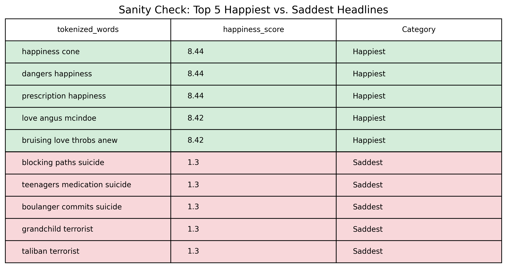
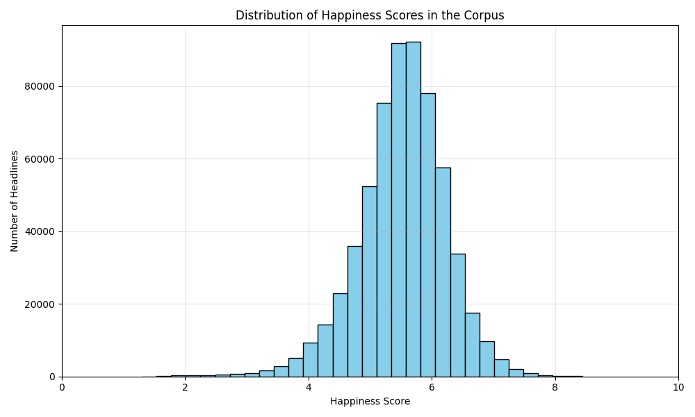
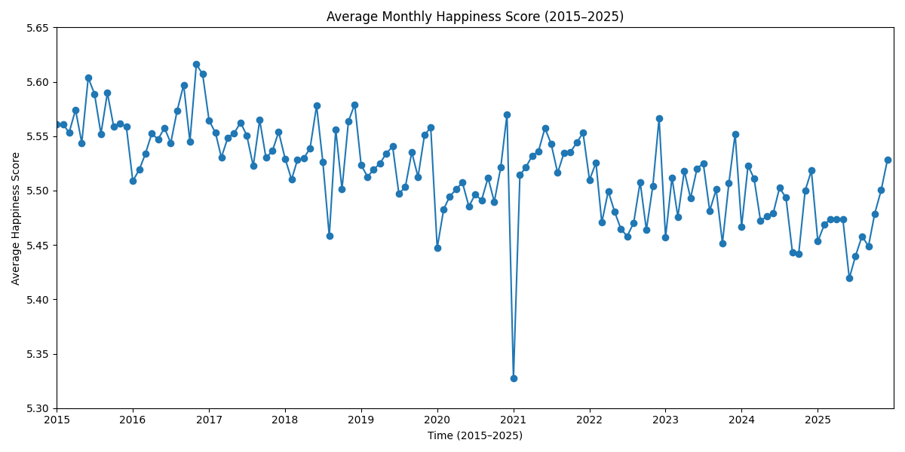
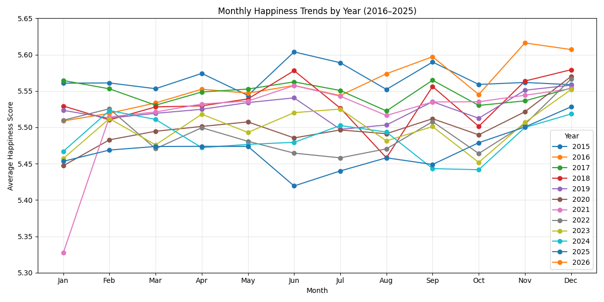
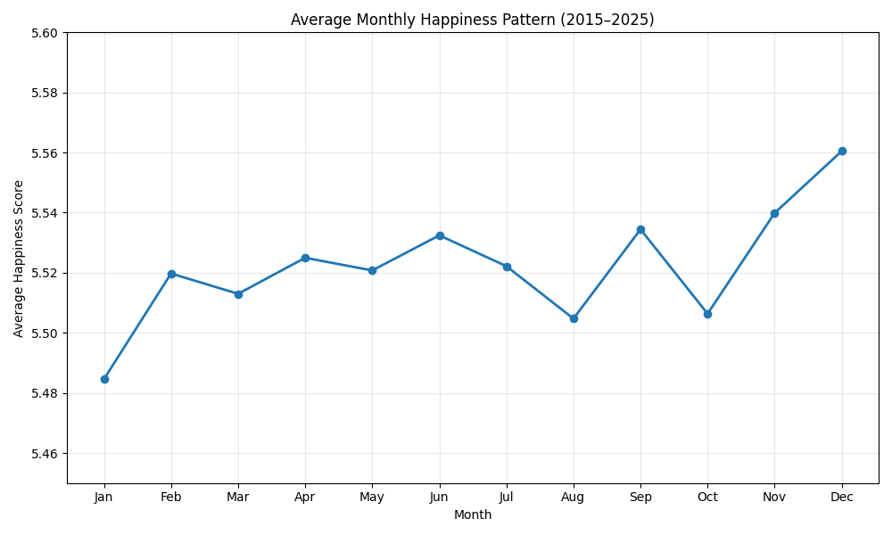

# Temporal Patterns of Happiness in the New York Times Headlines

This folder provides an **example project structure** (and an instructor/demo script) for using the **labMT 1.0** dataset together with the NYT headlines visualizations. (Data Set S1 from the Hedonometer paper).

It includes:
- the labMT 1.0 dataset file (`data/raw/Data_Set_S1.txt`) as well as the tokenized version of headlines (data/raw/Data_Set_Inference.csv)
- a runnable demo analysis script src/inference.py, src/scoring_logic.py, scr/sanity_check.py and src/nyt_visualisations.py 
- findings provided as pngs under figures

## Folder layout (course convention)

- `src/` — Python scripts you run
- `data/raw/` or 'data/processed/' — input data 
- `figures/` — PNG plots 
- `tables/` — CSV tables/summaries 
- `docs/` — assignment + paper companion + quickstart handout

## Setup + run (from the project root)

### 1) Create a virtual environment

**macOS / Linux**
```bash
python3 -m venv .venv
source .venv/bin/activate
python3 -m pip install --upgrade pip
```

**Windows (PowerShell)**
```powershell
py -m venv .venv
.\.venv\Scripts\Activate.ps1
py -m pip install --upgrade pip
```

### 2) Install dependencies
```bash
python3 -m pip install -r requirements.txt
```

### 3) Run the demo analysis
```bash
src/nyt_visualisations.py 
```

### What gets generated?
After running, look in:
- `figures/` — PNG plots
- `tables/` — CSV summary tables

# Research Topic: Temporal Patterns of Happiness in the New York Times
Overview: Our project highlights the temporal patterns of happiness in the headlines of The New York Times, one of the major news companies based in the US. We use the hedenometer developed by Dodds et al. (2011) in order to measure, describe and understand the levels of happiness of the language used by NYT and thus invoked in large audiences, treating it as a “fundamental societal metric”. Our project aims to answer the question: How does the happiness level of The New York Times titles vary over time from 2015 to 2025?


## 1: Dataset section: 
The chosen dataset was collected from The New York Times Developer API*. The newspaper was selected because it is representative of global events, as it covers domestic to the US, and international news, while also being widely recognized as trustworthy. The primary text unit analyzed was the headline, while the main metadata was the publication year used to analyze the change over time. Ethical considerations were respected by following the API usage limits and not redistributing copyrighted article content, and using the data only for academic research purposes.

** Please find the link to documentation for New York Times Developers API https://publicapis.io/new-york-times-api 


## 2: Methods section: 
### 2.1: Sample size
The analyzed sample consists of headlines from The New York Times from 2015 to 2025. This ten years frame was selected because it provides a sufficiently large amount of data to analyze the tendency of happiness in headlines. Covering this period allows us to analyze the impact of major global events that influence newspapers. At the same time, the specific limited time frames improves comparability across years, and grants the possibility to analyze modern historical events. Therefore, the selected sample size represents a balance between analytical depth, data availability and contextual relevance.

### 2.2: inference.py: fetch script: data scraping & cleaning; downloading API

For data acquisition cleaning and tokenisation, we followed the methodology outlined in the original paper by Dodds, which in our case resulted in the following steps:
1. Data extraction through the NYT API: parsed year, month, day to analyze happiness trends across 
   different years and months
2. Punctuation: stripped all symbols (including smart quotes) to normalise possessives (e.g., "sheinbaum's" -> "sheinbaums").
3. Case: lowercased all words to match the case-insensitive labMT word list.
4. Numbers: removed digits to focus on semantic words with emotional weight.
5. Kept full word forms to match the original labMT dataset.
6. Stop words: filtered neutral words (pronouns, prepositions, etc.) to increase the sensitivity of the later exploration and reduce data noise.

Why didn't we just use 'tokenize' function and choose a more manual approach? We decided to avoid standard library tokenisers (like NLTK's word_tokenize) because they would not provide the level of accuracy we wanted to achieve. They often split contractions (“don't” to “do” and “n't”) or keep punctuation as separate tokens, which would make it harder to match words directly to the labMT 1.0 dataset.


### 2.3: scoring_logic.py: data scoring; implementing and testing hedonometer

This script used the Data_Set_Inference.py to attach our data to the hedonometer.  

Using the dataset Data_Set_Inference.py, we used the 10222-word dictionary to align our tokens with the tokens for which there already was a happiness score. Total OOV word occurrences was 952695 times. Overall the dictionary covered most words (74%), covering more closer to 2015 than to 2025, probably because the Mechanical Turk was performed around the 2011 discourse, with social media not yet being flooded with the events to happen later. 

We used the weighted average formulat to count the happiness average of every headline:
$$H_d = \frac{\sum_{w} c_{dw} h_w}{\sum_{w} c_{dw}}$$

**Where:**
* $c_{dw}$ = the count of word $w$ in document $d$
* $h_w$ = the hedonometer happiness score for word $w$

This means that, by default, **repeated words count multiple times** in the final score. However, we decided to implement this, becuase we found that iteraion is a means of language that can strengthen its meaning. 

| Description | Count / Percentage |
| :--- | :--- |
| **Total tokens in dataset** | 3,676,622 |
| **Total OOV word tokens** | 952,695 |
| **OOV percentage** | 25.91% |
| **Dictionary coverage** | 74.09% |

Top 15 unmatched (oov words) by frequency: 
| word | frequency |
| :--- | :--- |
| **trumps** | 8990 |
| **covid** | 7,104 |
| **biden** | 6,522 |
| **coronavirus** | 4,483 |
| **corrections** | 3,777 |
| **ukraine** | 3,673 |
| **quotation** | 3,471 |
| **heres** | 3,153 |
| **pandemic** | 2,692 |
| **vaccine** | 2,070 |
| **tracker** | 1,960 |
| **chinas** | 1,847 |
| **bidens** | 1,742 |
| **syria** | 1,669 |
| **spelling** | 1,571 |

We then created a new dataset with the tokenized headlines applied to the hedonometer. The following data dictionary is applicable for the scored_nyt_headlines.py dataset: 
| Name | Data Represented | d-type | Example |
| :--- | :--- | :--- | :--- |
| **Year** | Year of headline publication | integer | 2015 |
| **Month** | Month of headline publication | integer | 1 |
| **Day** | Day of headline publication | integer | 1 |
| **tokenized_words** | Words in the headline separated into tokens, excluding stop words | string | knew wanted |
| **happiness_score** | Avg happiness score of remaining tokens in headline | float64 | 5.51 |
| **oov_words** | oov word | string | [ ] (none) |
| **match_count** | Count of matches of tokens in headline with hedonometer | integer | 2 |


Sanity check exploration: 

The sanity test came out to be “understandable”, meaning that we could presume that the headlines that were ranked around 8.43 were definitely more happy than the ones ranked 1.3, based on our critical thinking. The happiest headlines included either “happiness” or “love”, which are some of the top happiest words, therefore scoring these headlines as happiest. The saddest headlines commonly included disturbing thoughts such as suicide and terrorism. 

### 2.4: nyt_visualisation.py: creating plots and tables for analysis 
The above script uses the processed document containing the tokenised headlines that have been matched to the labMT happiness average scores. It contains the codes required to generate plots and tables that have been used for statistical inference and close reading, respectively. Some significant plots that we used for quantitative analysis include the happiness distribution of the headlines, the overall time-series trend of happiness average, binned by month and monthly trends that appear in the data. The tables for qualitative analysis allow a closer look at either tail of the dataset, and some stratified sampling of OOV headlines where we look for patterns to better critique our data and methods. 

## 3: Results section:
**Table 1. Happiness Average Distribution Summary of NYT Headlines**

| Statistic | Value |
| :--- | :--- |
| **count** | 611,807 |
| **mean** | 5.521405 |
| **standard deviation** | 0.706912 |
| **minimum** | 1.30 |
| **25%** | 5.126667 |
| **50%** | 5.56 |
| **75%** | 5.97 |
| **maximum** | 8.44 |

**Figure 1. Happiness Average Distribution of NYT Headlines**


The distribution of happiness scores shows that the mean of the entire corpus that was matched to the labMT dataset was 5.52, meaning that it leans towards a neutral to positive score. This indeed complements the analysis done by Dodds et al. (2011) that “English words, as they appear in natural language, are biased toward positivity”. This is further evident in the quartiles, wherein half of the scores lie between 5 and 6. Moreover, the corpus has a low standard deviation of 0.71, which indicates that there are fewer headlines with extremely high or low happiness scores, with most concentrated near the centre. This could potentially be representative of the journalistic standards for remaining neutral in the editorial texts.

**Figure 2. Overall Time-Series of Happiness Scores of NYT Headlines Averaged by Month (2015-2025)**


The above graph shows the overall trend in happiness average over the 11-year period. Here, we notice a slight downward trend in the happiness average as lower highpoints and newer lowpoints in the averaged scores through the years, indicating a shifting tone in the text. We assume that this could either represent real-world events, a shift in the writing style or a mix of both. Moreover, this plot also makes clear one outlier month in our dataset, i.e. January 2021, that was most likely caused by the political state in the United States at the time, since that is when the Capitol attack took place. 

**Figure 3a. Yearly Happiness Score Trends Averaged by Month (2015-2025)**


**Figure 3b. Monthly Happiness Average Pattern (2015-2025)**


Figures 3a and 3b make clear the emergence of monthly/seasonal patterns. Particularly noticeable here are the consistently low happiness average of headlines published in January and the significantly higher score during December. Although the pattern in 3b may be impacted by the outlier data from January 2021, the lower average is also evident in the overall trend, with evident dips at the beginning of each year. The high average scores in December can be explained by the festive season during the period around Christmas and New Year's, causing a surge in positive, festive vocabulary in the writing. 

### TBD: Estimating uncertainty: Bootstrap sampling
* level of analysis: yearly

## 4: Qualitative Exhibit:

### 4.1: Top 15 Most Positive Titles:

| Date | Happiness Score | Tokenized Words | Match Count |
| :--- | :--- | :--- | :--- |
| 2015-07-28 | 8.44 | prescription happiness | 1 |
| 2015-07-03 | 8.44 | happiness cone | 1 |
| 2015-07-18 | 8.44 | dangers happiness | 1 |
| 2016-07-29 | 8.42 | overcoming obstacles love | 1 |
| 2015-02-24 | 8.42 | outpouring love onesies | 1 |
| 2016-12-09 | 8.42 | syria love | 1 |
| 2016-08-24 | 8.42 | love bollywood | 1 |
| 2018-11-30 | 8.42 | luckenbooth scotlands love brooch | 1 |
| 2015-01-29 | 8.42 | love valerie steele | 1 |
| 2015-02-13 | 8.42 | love | 1 |
| 2020-03-06 | 8.42 | shortcuts love | 1 |
| 2019-01-12 | 8.42 | autocrats love emergencies | 1 |
| 2020-10-02 | 8.42 | love lockdown | 1 |
| 2019-07-06 | 8.42 | love peach cobbler | 1 |
| 2015-06-25 | 8.42 | love kurt elling | 1 |

### Top 15 Most Negative Headlines

| Date | Happiness Score | Tokenized Words | Match Count |
| :--- | :--- | :--- | :--- |
| 2016-09-30 | 1.30 | boulanger commits suicide | 1 |
| 2020-02-26 | 1.30 | taliban terrorist | 1 |
| 2020-05-19 | 1.30 | pandemic sparking suicide | 1 |
| 2019-10-25 | 1.30 | grandchild terrorist | 1 |
| 2015-03-09 | 1.30 | blocking paths suicide | 1 |
| 2023-01-01 | 1.30 | terrorist | 1 |
| 2015-08-03 | 1.30 | teenagers medication suicide | 1 |
| 2021-01-09 | 1.30 | fingerprints terrorist | 1 |
| 2022-09-27 | 1.30 | assisted suicide accessible | 1 |
| 2021-03-10 | 1.44 | fraudulent seduction rape | 1 |
| 2015-11-06 | 1.47 | deaths suicide | 2 |
| 2018-02-16 | 1.48 | martinis murder | 1 |
| 2016-03-24 | 1.48 | overreacting terrorism | 1 |
| 2018-01-21 | 1.48 | homegrown terrorism | 1 |
| 2022-10-22 | 1.48 | monkeys mysteries murder | 1 |

### match_count = 0 Stratified Random Sample
| Year | Date | Tokenized Words | Match Count |
| :--- | :--- | :--- | :--- |
| 2015 | 2015-01-20 | existential animation | 0 |
| 2016 | 2016-04-03 | acpt standings puzzle | 0 |
| 2017 | 2017-08-26 | huntergatherers | 0 |
| 2018 | 2018-06-27 | volgograd stalin lurks sideline | 0 |
| 2019 | 2019-08-06 | quentin tarantinos goddess gogo | 0 |
| 2020 | 2020-05-15 | reopening warily | 0 |
| 2021 | 2021-02-08 | babysitting | 0 |
| 2022 | 2022-03-18 | defi | 0 |
| 2023 | 2023-08-22 | waldorfs iconic statue rebirth iceland | 0 |
| 2024 | 2024-06-18 | stopandshop runways | 0 |
| 2025 | 2025-07-01 | strands sidekick | 0 |

The qualitative analysis focuses on the yearly variations of happiness, lexical patterns, and the role of unmatched words. The further analysis of these elements helps broaden the quantitative trends and substantiate how the changes in headlines over the years create a shift in news coverage. 

The most positive headlines often include words like love and happiness, which score very high in the LabMT lexicon hedonometer, and they are usually perceived as positive in many contexts. These words can generally be found in headlines of articles relating to leisure, lifestyle, and culture. The titles usually have few words, so even one word that scores highly can significantly affect the final happiness score of the headline. Secondly, some words in the headlines may remain unmatched to the LabMT lexicon, meaning that the final score is based on only a few words that were successfully matched. This suggests that highly scoring headlines may not be positive in the broad sense, but are shaped by one or two words with strongly positive scores. 

The most negative headlines display a similar pattern, however, trending in the opposite direction. These words include suicide, terrorist, murder, and rape. All these words are predominantly associated with violence, fear, and crises. Thus, the tone of the short titles can be dominated by these words on their own. This is because headlines are highly compressed forms of language; they contain fewer words, and thus each matched term brings more weight to the final score. Furthermore, if some words in the title remain without a match, the negatively matched words will skew the results in a negative direction. Thus, one strongly negative word can dominate the emotional tone of the headline, even if the content of the article is more complex and nuanced. This suggests that the method can be sensitive to the intensity of language in short titles, where a single association with violence and death can significantly affect the overall happiness score. This is especially visible when reporting on political topics, war, crime, and public emergencies. 

Moreover, some words in the dataset didn’t match the LabMT lexicon. This happens because the analysis relies on a dictionary of fixed words, meaning that proper nouns, recent and specialised terms, and compound forms of language are left without a match. Therefore, possibly meaningful words are omitted from the happiness analysis, presenting an important limitation to this method, which is expanded on in the critical reflection. The out-of-vocabulary words showcase that the lexical happiness analysis can capture a large selection of the words that can be matched, leaving some culture and topic-specific words outside of the lexical analysis. 

These three components allow us to see that happiness scores are produced and interpreted not only through the emotional scores of the words but also the structures of the headlines. The New York Times headlines are usually short and have produced a low match count in our analysis; thus, a few of the successfully matched words may disproportionately affect the results in either a positive or negative direction. The unmatched words highlight this limitation further, as meaningful key terms are completely left out of the analysis. Therefore, the results are best interpreted as showing changes in emotional tones of headlines, instead of a full reflection of the article’s meaning. 

## 5: Critical Reflection: 

This study analyzes the happiness score in the New York Times headlines between 2015 and 2025 by using the hedonometer based on the labMT happiness lexicon. While this method was functional for a quantitative analysis of the language patterns over time, some methodological and sampling limitations must be taken into account when interpreting the final results.

One important limitation concerns the dataset itself. The analysis is based solely on data from the NYT, therefore, representative of a signal newspaper. As a result, the dataset cannot represent global media sentiment. Although the NYT is one of the most renowned news outlets in the world, its reporting style reflects a U.S.-centric perspective. Consequently, the dataset reflects the editorial priorities of the newspaper rather than the objective global reality. Another limitation already mentioned in the qualitative analysis is the use of headlines as text data. Because headlines contain limited context, the sentiment calculation might not fully represent the tone of the final article. Additionally, the reliance on a predefined lexical dictionary, such as the labMT lexicon, limits the ability to capture an evolving language or context-specific words that frequently appear in the news.

The other issue to consider is the data collection and sampling. The data was collected using the NYT API, which allows access to the articles' metadata and enables the analysis of data on a large scale. However, API queries might limit access to articles, which might result in incomplete data retrieval. In addition, it is noted that there is a variation in the number of headlines over the years. Years with many headlines provide a stabler and more reliable average, while years with fewer headlines may produce results more related to specific events. Therefore, the variation of the dataset size might affect the stability of yearly happiness scores.

Interpreting the happiness scored in news headlines also presented challenges. Journalism focuses more on conflict, crises, and problems because they are considered more significant. As a result, a negative tone may be more common in newspapers. Therefore, it is more likely that the result of the happiness scores are the conditions in the real world conditions rather than a change in media.

Despite these limitations, this study demonstrates how computational text analysis can reveal patterns in media language over time. Providing a lens to interpret major events in modern history. The hedomemeter provides a useful tool to identify trends in emotional tone over time in large text datasets. Future studies can be improved by comparing multiple newspapers to show different perspectives. Another improvement can be categorizing the headlines into subject specific groups to gain a deeper understanding of hoe the tone shifts for different subjects.

In conclusion, while the results must be interpreted with awareness, the present and insight into how news tone mirrors broader social and historical trends within the period from 2015 to 2025.

## 6: Credits: 
Nadiya - Data Acquisition Lead
Valerija - Measurement Lead
Sadia - Quantitative Analyst
Sara - Provenance and Critical Reflection.
Merey - Qualitative Analysis and Close Reading. 


## References: 
  Dodds PS, Harris KD, Kloumann IM, Bliss CA, Danforth CM (2011) Temporal Patterns of Happiness and Information in a Global Social Network:
Hedonometrics and Twitter. PLoS ONE 6(12): e26752. doi:10.1371/journal.pone.0026752 
